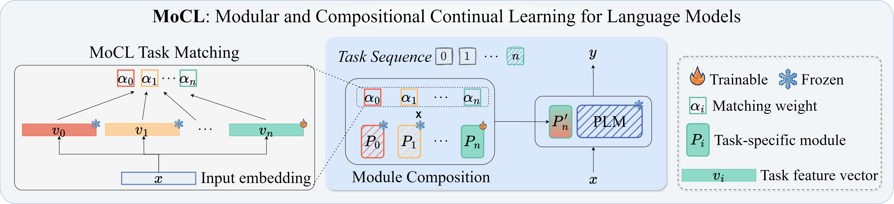

# MoCL-NAACL-2024

This repository is an original implementation for:

>[NAACL 2024] [Rehearsal-Free Modular and Compositional Continual Learning for Language Models](https://arxiv.org/abs/2404.00790)


## 💡 Introduction



We introduce MoCL, a rehearsal-free modular and compositional continual learning framework for language models. MoCL avoids catastrophic forgetting without storing additional data and facilitates effective knowledge transfer via module composition. MoCL outperforms state-of-the-art methods across various continual learning benchmarks.

This repository showcases the implementation and application of the MoCL framework. It includes various components necessary for setting up the environment, processing datasets, and running the model to achieve state-of-the-art results in designated tasks.

## 🔧 Environment Setup
To run the MoCL framework, you need to set up your environment as follows:

```shell
conda create -n mocl python=3.8.5
conda activate mocl
```

Follow the [PyTorch page](https://pytorch.org/get-started/locally/) to install torch related packages, e.g.,:
```shell
pip install torch torchvision torchaudio
```

Finally, install other required packages via:
```shell
pip install git+https://github.com/huggingface/transformers
pip install -r env.txt
```

## 📥 Dataset
The dataset we used in this work can be downloaded from: 
- (1) [WOS](https://huggingface.co/datasets/web_of_science); 
- (2) [AfriSenti](https://drive.google.com/file/d/1MLSPKSUgpaFcomP1P5ynSVgX6KtskzMi/view?usp=sharing); 
- (3) [MTL5](https://github.com/arazd/ProgressivePrompts) (For BERT and T5-based experiments);
- (4) [MTL15](https://github.com/cmnfriend/O-LoRA/tree/main/CL_Benchmark) (For LLama2-based experiments).

After downloading, please organize the data as follows:
```
./datasets
├── afrisenti
│   ├── dev
│   └── test
│   └── train
├── mtl5
│   ├── test
│   └── train
├── mtl15
│   ├── agnews
│   └── amazon
│   └── dbpedia
│   └── yahoo
│   └── ...
├── wos
│   ├── Meta-data
│   └── WOS11967
│   └── ...
```

## ⏳ Running MoCL
All scripts for running MoCL on the provided datasets are given in [`run_continual_script`](run_continual_script/). For example, to run MoCL on the AfriSenti dataset, execute the following command:

```shell
sh run_continual_script/afrisenti/E2_compose_prompt_orders.sh
```

## 📃 License
The code in this repository is open-sourced under the AGPL-3.0 license. See the [LICENSE](LICENSE) file for details. For a list of other open source components included in this project, see the file [3rd-party-licenses.txt](3rd-party-licenses.txt).

## 📙 Citation
If you found our work useful for your research, please cite it as follows:

```latex
@article{wang2024rehearsal,
  title={Rehearsal-Free Modular and Compositional Continual Learning for Language Models},
  author={Wang, Mingyang and Adel, Heike and Lange, Lukas and Str{\"o}tgen, Jannik and Sch{\"u}tze, Hinrich},
  journal={arXiv preprint arXiv:2404.00790},
  year={2024}
}
```

